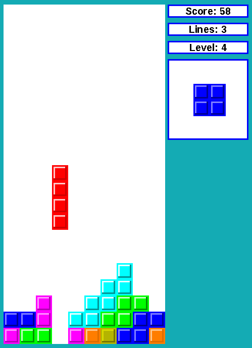

# Moblok'

[Ver en Español](README_ES.md)



## About

Moblok' is a clone of the game Tetris. It has been developed in C++ and making use of the SDL libraries (2.0).

## Current status

**Almost completed but inactive**. A playable demo can be downloaded from the [releases page](https://github.com/moisesjbc/moblok/releases).

## Playing the latest release

1. Go to the [releases page](https://github.com/Neodivert/moblok/releases).
2. Find and download the latest release that matches your OS and architecture.
3. (Windows only): Unzip the downloaded file and execute moblok.exe.
3. (Linux only - DEB): Unzip and install the downloaded DEB package. Then, execute Moblok' from Ubuntu's dashboard.
4. Enjoy!.

## Building Moblok' from code (Tested in Ubuntu 14.04)

### Dependencies

Building tools:
- [g++ (C++ compiler)](http://gcc.gnu.org/).
- [cmake 2.8](http://www.cmake.org/)

Libraries (both development and runtime versions):
- [SDL 2](http://www.libsdl.org/)
- [SDL_image 2](http://www.libsdl.org/projects/SDL_image/)
- [SDL_mixer 2](http://www.libsdl.org/projects/SDL_mixer/)
- [SDL_ttf 2](http://www.libsdl.org/projects/SDL_ttf/)

### Donwloading and building

1. Install the dependencies.

 ```
 sudo apt-get install libsdl2-dev libsdl2-image-dev libsdl2-mixer-dev libsdl2-ttf-dev fonts-liberation
 ```

2. Clone the [Moblok' repository at Github](https://github.com/Neodivert/moblok/)

 ```
 git clone git@github.com:moisesjbc/moblok.git
 ```

3. Enter in Moblok' directory

 ```
 cd moblok
 ```

4. Build the game

 ```
 cmake .
 make
 sudo make install
 ```

5. Run the game and enjoy!

 ```
 moblok
 ```

## License

### Own work

* **Source code:** GPLv3.
* **Images:** [Creative Commons Attribution 4.0 International (CC BY 4.0)](http://creativecommons.org/licenses/by/4.0/).

## Third-party work

* **Libraries SDL, SDL_image, SDL_mixer and SDL_ttf:** License for each one can be found in their respective websites.
* **Music:** The music used in the game has been downloaded from Wikimedia Commons on [this link](http://commons.wikimedia.org/wiki/File:Tetris_theme.ogg?uselang=es). As mentioned in that link, the music has been created by user "Bogozi" and it is licensed under a [Creative Commons Attribution-ShareAlike 3.0 Unported license (CC BY-SA 3.0)](http://creativecommons.org/licenses/by-sa/3.0/).
* **Font:** The font used in Moblok' is LiberationSans-Bold.ttf, [licensed under SIL Open Font License (version 2 onwards) or GPL v2 with some exceptions (older versions)](http://en.wikipedia.org/wiki/Liberation_fonts).
